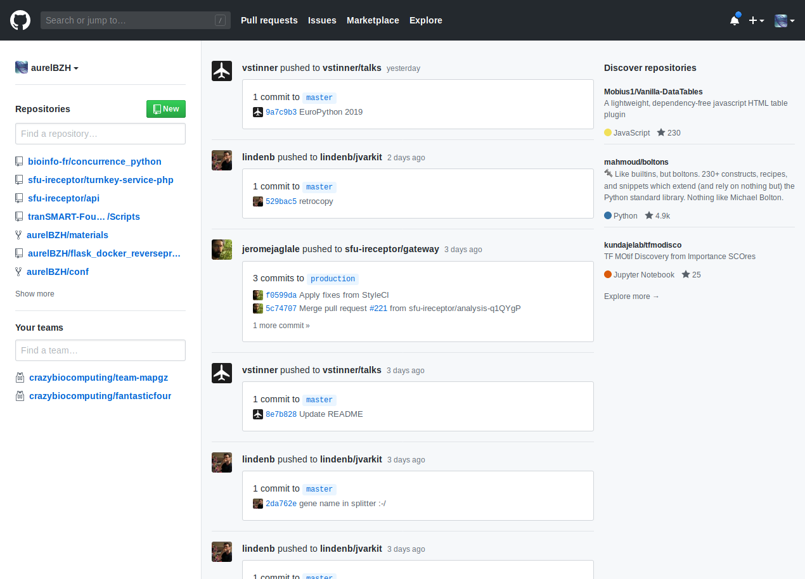
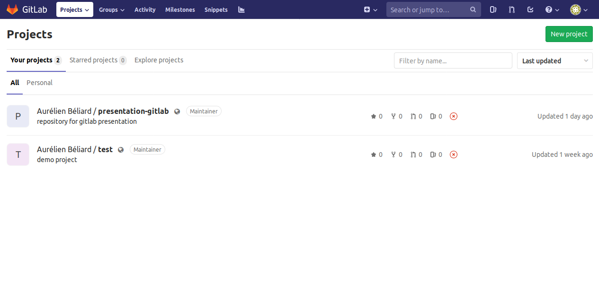
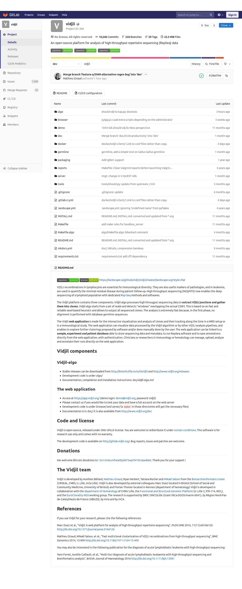
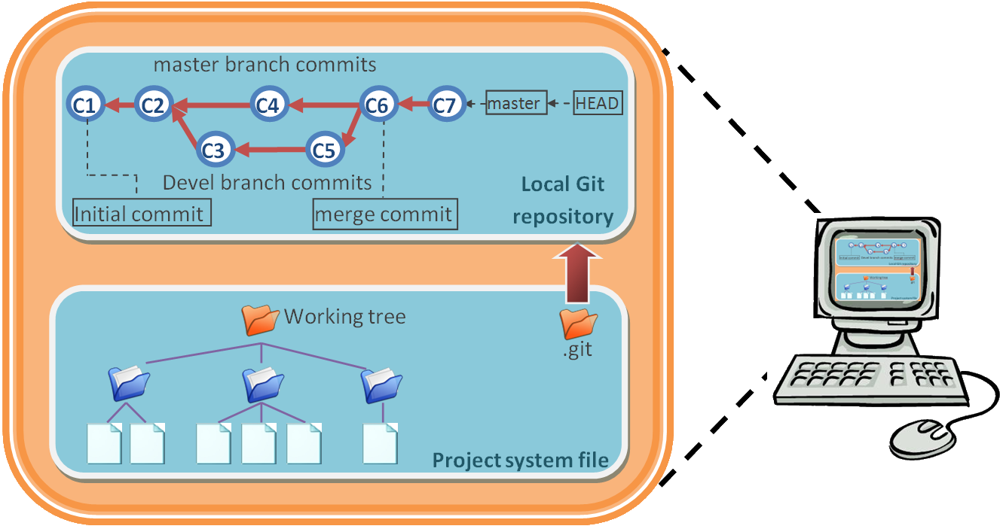

class: center, middle


# Introduction a Git et Gitlab 

### Qu'est ce qu'un gestionnaire de version ? Comment et pourquoi les utiliser ?

<small>Aurélien Béliard</small>

---
template: contentleft

## Objectifs de la présentation

  *  Expliquer l'utilité de Git et la différence entre Git et Gitlab.

  *  Citer les types de fichiers que Git peut prendre en charge.

  *  Montrer les principales commandes Git.

  *  Explorer un dépôt Git existant.

---

.center[

]

.footnote[.ref[
	Source : [PhD Comics](http://phdcomics.com/comics/archive.php?comicid=1531)
]]

---

## Votre script R... 3 mois... 1 an après
---

template: contentleft

## Lequel choisir ?
```bash
$ ls
R_script_03-04-2018.R        R_script_final_modified2.R
R_script_17-06-2018.R        R_script_final.R
R_script_18-03-2018.R        R_script_OK.R
R_script_final_2018-09-20.R  R_script.R
R_script_final_final.R       R_script_really_final.R
```
---
template: contentleft

# Gestionnaires de versions

(*version control systems*)

--

.leftcol[
#### Centralisés :
CVS (1990) <br>
Subversion / SVN (2000)

#### Distribués :

Git (2005)) <br>
Mercurial (2005)) <br>
Bazaar (2005) ) <br>
Veracity (2011)
]

--

.rightcol[

### Qui ? Quand ? Pourquoi ?

Qui a modifié le fichier ? 💻

Quand le fichier a été modifié ? 💻

Pourquoi le fichier a été modifié ? 🤓

]

--

<div style="clear:both;"></div>

### Quoi ?

Des fichiers **textes** relativement « petits » (< 100 Mo)

---

### Gestionnaire de version centralisé 


---

### Gestionnaire de version décentralisé 
.center[
]
.footnote[.ref[
	Source : [jerome Esnault](http://esnault.jerome1.free.fr/wordpress/?p=348)
]]
---

## Git

* il existe plusieurs gestionnaire de version décentralisé mais le plus utilisé est git 
.center[

]
* windows/mac/linux
---

<!-- .slide: data-background="/image/github-s.png" -->

## github
.center[

]

---

## gitlab

.center[



]

---
.center[

]

---
.center[

]

---

## comment travailler avec un dépot git 

.center[

]
.footnote[.ref[
	Source : [jerome Esnault](http://esnault.jerome1.free.fr/wordpress/?p=348)
]]
---

template: contentleft

# principales commande Git

Dans un terminal, dans un répertoire

.leftcol[

```bash
# Définir son identité. À faire une seule fois.
$ git config --global user.name "Prénom Nom"
$ git config --global user.email "moi@mail.com"

# Vérifier si Git est bien installé
# et afficher la version.
$ git --version

# Initialiser le répertoire (= dépôt).
$ git init

# Afficher le statut du dépôt.
$ git status

# Sélectionner les fichiers à enregistrer.
$ git add <nom-du-fichier>
# Enregistrer l'état (= prendre la photo).
$ git commit -m "Texte d'explication"

# Afficher l'historique.
# Touche q pour quitter.
$ git log
```

]

.rightcol[

```bash
# Lister les branches.
$ git branch 
# Créer une branche.
$ git branch <nom-d-une-branche>
# Changer de branche.
$ git checkout <nom-d-une-branche-existante>
# Fusionner deux branches.
$ git merge <nom-d-une-branche-existante>
# Supprimer une branche.
$ git branch -d <nom-d-une-branche-existante>
```

Avec Gitlab
```bash
# Ajouter un dépôt distant (sur GitHub).
$ git remote add <adresse-du-dépôt>
# Affichez les dépôts distants.
$ git remote
# Récupérer les modifications depuis GitHub.
$ git pull origin master
# Envoyer les modifications sur Github.
$ git push origin master
```

]


---
template: contentleft

## Bonnes pratiques

### Que met-on dans un dépôt Git ?

--

Des fichiers avec lesquels Git peut « calculer » la différence entre deux versions.

--

Le plus souvent des fichiers *texte* de taille *raisonnable* :

- un script R ✅
- un fichier PDF ❌
- un script Python ✅
- un fichier fastq ❌
- une image (❌ si générée automatiquement, sinon ✅)
- un fichier raw (protéomique) ❌


---


.footnote[
	.ref[[DOI 10.1371/journal.pcbi.1003285](https://doi.org/10.1371/journal.pcbi.1003285)]
]

--

<div style="background: #dfdfdf;
			font-size: 1.5rem;
			padding: 15px;
			border-radius: 15px;
			diplay: block;
			position: absolute;
			bottom: 150px;
			right: 220px;">
<q>Rule 4: Version Control All Custom Scripts</q>
</div>

---
template: contentleft

.leftcol[

]

.rightcol[
.bigger[
> “Most researchers are primarily collaborating with themselves,” [Tracy] Teal explains. “So, we teach it from the perspective of being helpful to a ‘future you’."
]
]

.footnote.ref[
	J. Perkel, [Nature Index, 2018](https://www.natureindex.com/news-blog/when-it-comes-to-reproducible-science-git-is-code-for-success)
]

---

##Conclusion :
###Avantage :

  * permet de centraliser le code en un même endroit
  * lié code et documentation 
  * gardé une trace des différentes versions et modifications
  *  facilite le travaille collaboratif

###Inconvénient :

  * peut parfois etre complexe pour des utilisations avancés		

---
## Ressources
Ma principale source pour cette introduction : 
* [Introduction a Git et Github](https://github.com/omics-school/git-github) par Pierre Poulain Pour Duomiques


[Introduction aux gestionnaires de versions](http://esnault.jerome1.free.fr/wordpress/?p=348)

Lire les articles du blog de Christophe Ducamp :

* [GitHub Pour les Nuls : Pas de Panique, Lancez-Vous ! (Première Partie)](https://www.christopheducamp.com/2013/12/15/github-pour-nuls-partie-1/)
* [GitHub pour les Débutants : Consignez, Poussez et Foncez !](https://www.christopheducamp.com/2013/12/16/github-pour-nuls-partie-2/)

---

